# 🪐 Google Antigravity Workspace Template (Enterprise Edition)


Welcome to the **Antigravity Workspace Template**. This is a production-grade starter kit for building autonomous agents on the Google Antigravity platform, fully compliant with **Antigravity Official Documentation**.

## 🧠 Core Philosophy: Artifact-First

This workspace enforces the **Artifact-First** protocol. The Agent does not just write code; it produces tangible outputs (Artifacts) for every complex task.

1.  **Planning**: `artifacts/plan_[task_id].md` is created before coding.
2.  **Evidence**: Logs and test outputs are saved to `artifacts/logs/`.
3.  **Visuals**: UI changes generate screenshot artifacts.

## 🛸 How It Works

The agent follows a strict "Think-Act-Reflect" loop, simulating the cognitive process of Gemini 3.

```mermaid
sequenceDiagram
    participant User
    participant Agent as 🤖 GeminiAgent
    participant Memory as 🧠 Memory
    participant Tools as 🛠️ Tools
    participant Artifacts as 📂 Artifacts

    User->>Agent: "Refactor Authentication"
    activate Agent
    
    Agent->>Artifacts: Create Implementation Plan
    
    Note over Agent: <thought> Deep Think Process </thought>
    Agent->>Agent: Formulate Strategy
    
    Agent->>Tools: Execute Tool (code_edit)
    activate Tools
    Tools-->>Agent: Result
    deactivate Tools
    
    Agent->>Artifacts: Save Logs/Evidence
    
    Agent-->>User: Final Report (Walkthrough)
    deactivate Agent
```



## ✨ Key Features

-   **Official Compliance**: Fully adheres to `.antigravity/rules.md`.
-   **Auto-Configuration**: `.cursorrules` redirects to the official rules engine.
-   **Modular Architecture**: Logic separated into `src/` (Agent, Memory, Config).
-   **DevOps Ready**: Includes `Dockerfile`, `docker-compose.yml`, and CI/CD workflows.
-   **Type-Safe**: Built with `pydantic` and strict type hints.

## 🚀 Quick Start

### Local Development
1.  **Install Dependencies**:
    ```bash
    pip install -r requirements.txt
    ```
2.  **Run the Agent**:
    ```bash
    python src/agent.py
    ```

### Docker Deployment
1.  **Build & Run**:
    ```bash
    docker-compose up --build
    ```

## 📂 Project Structure

```
.
├── .antigravity/       # 🛸 Official Antigravity Config
│   └── rules.md        # Agent Rules & Permissions
├── artifacts/          # 📂 Agent Outputs (Plans, Logs, Visuals)
├── .context/           # AI Knowledge Base
├── .github/            # CI/CD Workflows
├── src/                # Source Code
│   ├── agent.py        # Main Agent Logic
│   ├── config.py       # Settings Management
│   ├── memory.py       # JSON Memory Manager
│   └── tools/          # Agent Tools
├── tests/              # Test Suite
├── .cursorrules        # Compatibility Pointer
├── Dockerfile          # Production Build
├── docker-compose.yml  # Local Dev Setup
└── mission.md          # Agent Objective
```

## 🚀 The "Zero-Config" Workflow

Stop writing long system prompts. This workspace pre-loads the AI's cognitive architecture for you.

### Step 1: Clone & Rename (The "Mold")
Treat this repository as a factory mold. Clone it, then rename the folder to your project name.
```bash
git clone https://github.com/study8677/antigravity-workspace-template.git my-agent-project
cd my-agent-project
# Now you are ready. No setup required.
```

### Step 2: The Magic Moment ⚡️
Open the folder in Cursor or Google Antigravity.
-   👀 **Watch**: The IDE automatically detects `.cursorrules`.
-   🧠 **Load**: The AI silently ingests the "Antigravity Expert" persona from `.antigravity/rules.md`.

### Step 3: Just Prompt (No Instructions Needed)
You don't need to tell the AI to "be careful" or "use the src folder". It's already brainwashed to be a Senior Engineer.

❌ **Old Way (Manual Prompting)**:
> "Please write a snake game. Make sure to use modular code. Put files in src. Don't forget comments..."

✅ **The Antigravity Way**:
> "Build a snake game."

The AI will automatically:
1.  🛑 **Pause**: "According to protocols, I must plan first."
2.  📄 **Document**: Generates `artifacts/plan_snake.md`.
3.  🔨 **Build**: Writes modular code into `src/game/` with full Google-style docstrings.

## 🗺️ Roadmap

- [x] **Phase 1: Foundation** (Scaffold, Config, Memory)
- [x] **Phase 2: DevOps** (Docker, CI/CD)
- [x] **Phase 3: Antigravity Compliance** (Rules, Artifacts)
- [ ] **Phase 4: Advanced Memory** (Vector Database Integration)
- [ ] **Phase 5: Multi-Agent Orchestration** (Swarm Protocol)
