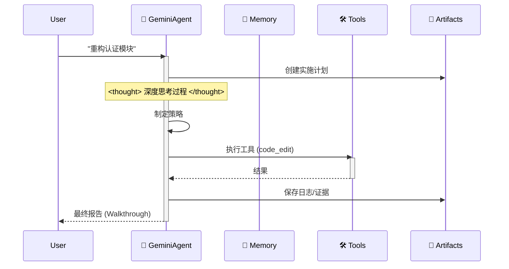

# 🪐 Google Antigravity 工作区模板 (企业版)


欢迎使用 **Antigravity 工作区模板**。这是一个生产级的入门套件，用于在 Google Antigravity 平台上构建自主 Agent，完全符合 **Antigravity 官方文档**。

## 🧠 核心理念：Artifact-First (产物优先)

本工作区强制执行 **Artifact-First** 协议。Agent 不仅仅是编写代码；它必须为每个复杂的任务生成有形的 **Artifact (产物)**。

1.  **规划 (Planning)**：在编写代码之前，必须先创建 `artifacts/plan_[task_id].md`。
2.  **证据 (Evidence)**：测试日志和输出必须保存到 `artifacts/logs/`。
3.  **视觉 (Visuals)**：UI 变更必须生成截图产物。

## 🛸 工作原理

Agent 遵循严格的 "Think-Act-Reflect" (思考-行动-反思) 循环，模拟 Gemini 3 的认知过程。



## ✨ 主要特性

-   **官方合规**：完全遵守 `.antigravity/rules.md`。
-   **自动配置**：`.cursorrules` 重定向到官方规则引擎。
-   **模块化架构**：逻辑分离为 `src/` (Agent, Memory, Config)。
-   **DevOps 就绪**：包含 `Dockerfile`, `docker-compose.yml`, 和 CI/CD 工作流。
-   **类型安全**：基于 `pydantic` 构建，使用严格的类型提示。

## 🚀 快速开始

### 本地开发
1.  **安装依赖**：
    ```bash
    pip install -r requirements.txt
    ```
2.  **运行 Agent**：
    ```bash
    python src/agent.py
    ```

### Docker 部署
1.  **构建并运行**：
    ```bash
    docker-compose up --build
    ```

## 📂 项目结构

```
.
├── .antigravity/       # 🛸 官方 Antigravity 配置
│   └── rules.md        # Agent 规则与权限
├── artifacts/          # 📂 Agent 产物 (计划, 日志, 视觉)
├── .context/           # AI 知识库
├── .github/            # CI/CD 工作流
├── src/                # 源代码
│   ├── agent.py        # Agent 主要逻辑
│   ├── config.py       # 设置管理
│   ├── memory.py       # JSON 记忆管理器
│   └── tools/          # Agent 工具
├── tests/              # 测试套件
├── .cursorrules        # 兼容性指针
├── Dockerfile          # 生产环境构建
├── docker-compose.yml  # 本地开发设置
└── mission.md          # Agent 目标
```

## 🚀 "零配置" 工作流

停止编写冗长的系统提示词。本工作区为您预加载了 AI 的认知架构。

### 第一步：克隆与重命名 ("模具")
将此仓库视为工厂模具。克隆它，然后将文件夹重命名为您的项目名称。
```bash
git clone https://github.com/study8677/antigravity-workspace-template.git my-agent-project
cd my-agent-project
# 现在您已准备就绪。无需设置。
```

### 第二步：魔法时刻 ⚡️
在 Cursor 或 Google Antigravity 中打开文件夹。
-   👀 **观察**：IDE 自动检测 `.cursorrules`。
-   🧠 **加载**：AI 静默地从 `.antigravity/rules.md` 摄取 "Antigravity Expert" 人格。

### 第三步：直接提示 (无需指令)
您不需要告诉 AI "要小心" 或 "使用 src 文件夹"。它已经被“洗脑”成为一名高级工程师。

❌ **旧方式 (手动提示)**:
> "请写一个贪吃蛇游戏。确保使用模块化代码。把文件放在 src 里。别忘了写注释..."

✅ **Antigravity 方式**:
> "构建一个贪吃蛇游戏。"

AI 将自动：
1.  🛑 **暂停**："根据协议，我必须先制定计划。"
2.  📄 **文档**：生成 `artifacts/plan_snake.md`。
3.  🔨 **构建**：将模块化代码写入 `src/game/`，并附带完整的 Google 风格文档字符串。

## 🗺️ 路线图

- [x] **阶段 1: 基础** (脚手架, 配置, 记忆)
- [x] **阶段 2: DevOps** (Docker, CI/CD)
- [x] **阶段 3: Antigravity 合规** (规则, 产物)
- [ ] **阶段 4: 高级记忆** (向量数据库集成)
- [ ] **阶段 5: 多 Agent 编排** (Swarm 协议)
