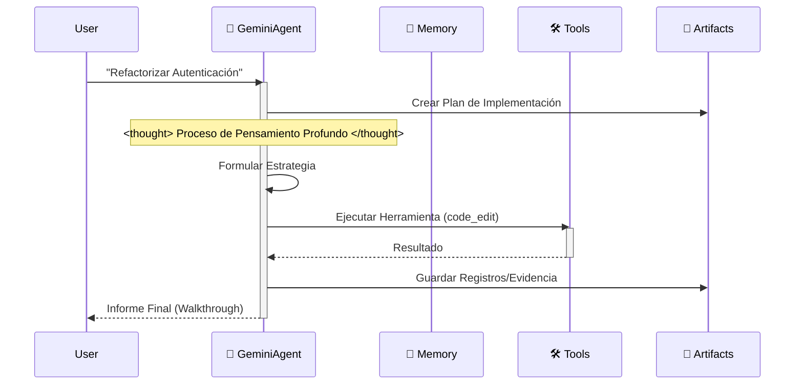

# 🪐 Plantilla de Espacio de Trabajo Google Antigravity (Edición Empresarial)


Bienvenido a la **Plantilla de Espacio de Trabajo Antigravity**. Este es un kit de inicio de nivel de producción para construir agentes autónomos en la plataforma Google Antigravity, totalmente compatible con la **Documentación Oficial de Antigravity**.

## 🧠 Filosofía Central: Artifact-First (Artefacto-Primero)

Este espacio de trabajo impone el protocolo **Artifact-First**. El Agente no solo escribe código; produce resultados tangibles (Artefactos) para cada tarea compleja.

1.  **Planificación**: Se crea `artifacts/plan_[task_id].md` antes de codificar.
2.  **Evidencia**: Los registros de prueba y salidas se guardan en `artifacts/logs/`.
3.  **Visuales**: Los cambios en la UI generan artefactos de captura de pantalla.

## 🛸 Cómo Funciona

El agente sigue un estricto bucle "Pensar-Actuar-Reflexionar", simulando el proceso cognitivo de Gemini 3.



## ✨ Características Clave

-   **Cumplimiento Oficial**: Se adhiere completamente a `.antigravity/rules.md`.
-   **Auto-Configuración**: `.cursorrules` redirige al motor de reglas oficial.
-   **Arquitectura Modular**: Lógica separada en `src/` (Agente, Memoria, Configuración).
-   **Listo para DevOps**: Incluye `Dockerfile`, `docker-compose.yml`, y flujos de trabajo CI/CD.
-   **Tipado Seguro**: Construido con `pydantic` y sugerencias de tipo estrictas.

## 🚀 Inicio Rápido

### Desarrollo Local
1.  **Instalar Dependencias**:
    ```bash
    pip install -r requirements.txt
    ```
2.  **Ejecutar el Agente**:
    ```bash
    python src/agent.py
    ```

### Despliegue con Docker
1.  **Construir y Ejecutar**:
    ```bash
    docker-compose up --build
    ```

## 📂 Estructura del Proyecto

```
.
├── .antigravity/       # 🛸 Configuración Oficial de Antigravity
│   └── rules.md        # Reglas y Permisos del Agente
├── artifacts/          # 📂 Salidas del Agente (Planes, Registros, Visuales)
├── .context/           # Base de Conocimiento de IA
├── .github/            # Flujos de Trabajo CI/CD
├── src/                # Código Fuente
│   ├── agent.py        # Lógica Principal del Agente
│   ├── config.py       # Gestión de Configuraciones
│   ├── memory.py       # Gestor de Memoria JSON
│   └── tools/          # Herramientas del Agente
├── tests/              # Suite de Pruebas
├── .cursorrules        # Puntero de Compatibilidad
├── Dockerfile          # Construcción de Producción
├── docker-compose.yml  # Configuración de Desarrollo Local
└── mission.md          # Objetivo del Agente
```

## 🚀 El Flujo de Trabajo "Cero-Configuración"

Deja de escribir largos prompts del sistema. Este espacio de trabajo precarga la arquitectura cognitiva de la IA por ti.

### Paso 1: Clonar y Renombrar (El "Molde")
Trata este repositorio como un molde de fábrica. Clónalo, luego renombra la carpeta con el nombre de tu proyecto.
```bash
git clone https://github.com/study8677/antigravity-workspace-template.git my-agent-project
cd my-agent-project
# Ahora estás listo. No se requiere configuración.
```

### Paso 2: El Momento Mágico ⚡️
Abre la carpeta en Cursor o Google Antigravity.
-   👀 **Observa**: El IDE detecta automáticamente `.cursorrules`.
-   🧠 **Carga**: La IA ingiere silenciosamente la persona de "Experto en Antigravity" desde `.antigravity/rules.md`.

### Paso 3: Solo Pregunta (No Se Necesitan Instrucciones)
No necesitas decirle a la IA que "tenga cuidado" o "use la carpeta src". Ya está programada para ser un Ingeniero Senior.

❌ **Vieja Forma (Prompting Manual)**:
> "Por favor escribe un juego de la serpiente. Asegúrate de usar código modular. Pon los archivos en src. No olvides los comentarios..."

✅ **La Forma Antigravity**:
> "Construye un juego de la serpiente."

La IA automáticamente:
1.  🛑 **Pausa**: "Según los protocolos, debo planificar primero."
2.  📄 **Documenta**: Genera `artifacts/plan_snake.md`.
3.  🔨 **Construye**: Escribe código modular en `src/game/` con docstrings completos estilo Google.

## 🗺️ Hoja de Ruta

- [x] **Fase 1: Fundación** (Andamiaje, Configuración, Memoria)
- [x] **Fase 2: DevOps** (Docker, CI/CD)
- [x] **Fase 3: Cumplimiento Antigravity** (Reglas, Artefactos)
- [ ] **Fase 4: Memoria Avanzada** (Integración de Base de Datos Vectorial)
- [ ] **Fase 5: Orquestación Multi-Agente** (Protocolo Swarm)
